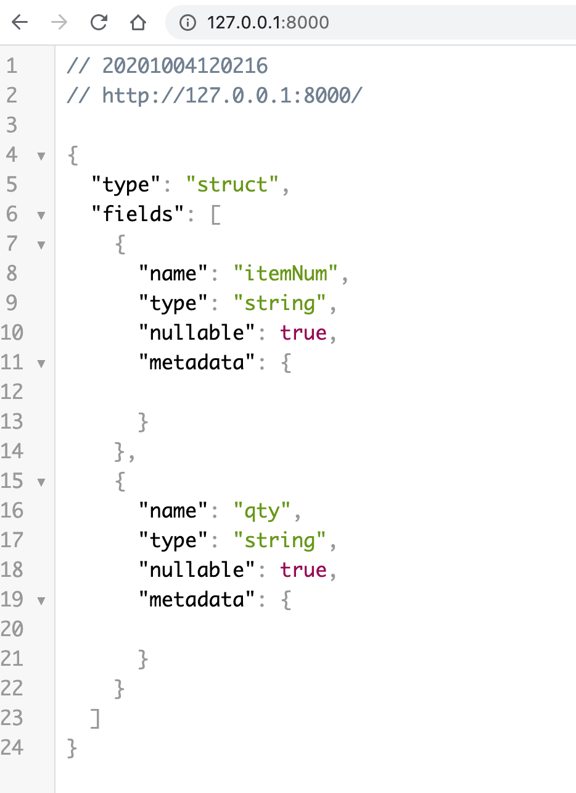

# Running spark program in nodejs

## GraalVM install info

- [Install Instructions](https://www.graalvm.org/docs/getting-started-with-graalvm/macos/)
- [install bundle](https://github.com/graalvm/graalvm-ce-builds/releases/download/vm-20.2.0/graalvm-ce-java11-darwin-amd64-20.2.0.tar.gz)

```
~/Downloads$ tar -xvf graalvm-ce-java11-darwin-amd64-20.2.0.tar.gz
~/Downloads$ sudo mv graalvm-ce-java11-20.2.0 /Library/Java/JavaVirtualMachines
$ export PATH=/Library/Java/JavaVirtualMachines/graalvm-ce-java11-20.2.0/Contents/Home/bin:$PATH
# To verify if the move is successful and to get a list of all installed JDKs, 
$ /usr/libexec/java_home -V

# ref: https://developer.apple.com/news/?id=09032019a - Notarizing Your Mac Software for macOS Catalina

$ sudo xattr -r -d com.apple.quarantine /Library/Java/JavaVirtualMachines/graalvm-ce-java11-20.2.0

```

## Test
```
~/graalVM:
$ /Library/Java/JavaVirtualMachines/graalvm-ce-java11-20.2.0/Contents/Home/bin/node  --jvm
Welcome to Node.js v12.18.0.
Type ".help" for more information.

$ CLASSPATH=$(find "$SPARK_HOME/jars/" -name '*.jar' | xargs echo | tr ' ' ':')
$ bin/node  --jvm --vm.cp $CLASSPATH


```

### Run spark program
```
$ /Library/Java/JavaVirtualMachines/graalvm-ce-java11-20.2.0/Contents/Home/bin/node  --jvm   --vm.cp $CLASSPATH
Welcome to Node.js v12.18.0.
Type ".help" for more information.
> var sparkSessionType = Java.type("org.apache.spark.sql.SparkSession")
undefined
> var sparkSession = sparkSessionType.builder().master("local[*]").appName("example").getOrCreate()
2020-10-04 11:52:41 INFO  SparkContext:54 - Running Spark version 2.4.0
WARNING: An illegal reflective access operation has occurred
WARNING: Illegal reflective access by org.apache.hadoop.security.authentication.util.KerberosUtil (file:/Users/mchinnappan/etl/spark-2.4.0-bin-hadoop2.7/jars/hadoop-auth-2.7.3.jar) to method sun.security.krb5.Config.getInstance()
WARNING: Please consider reporting this to the maintainers of org.apache.hadoop.security.authentication.util.KerberosUtil
WARNING: Use --illegal-access=warn to enable warnings of further illegal reflective access operations
WARNING: All illegal access operations will be denied in a future release
2020-10-04 11:52:41 WARN  NativeCodeLoader:62 - Unable to load native-hadoop library for your platform... using builtin-java classes where applicable
2020-10-04 11:52:41 INFO  SparkContext:54 - Submitted application: example
2020-10-04 11:52:41 INFO  SecurityManager:54 - Changing view acls to: mchinnappan
2020-10-04 11:52:41 INFO  SecurityManager:54 - Changing modify acls to: mchinnappan
2020-10-04 11:52:41 INFO  SecurityManager:54 - Changing view acls groups to: 
2020-10-04 11:52:41 INFO  SecurityManager:54 - Changing modify acls groups to: 
2020-10-04 11:52:41 INFO  SecurityManager:54 - SecurityManager: authentication disabled; ui acls disabled; users  with view permissions: Set(mchinnappan); groups with view permissions: Set(); users  with modify permissions: Set(mchinnappan); groups with modify permissions: Set()
2020-10-04 11:52:41 INFO  Utils:54 - Successfully started service 'sparkDriver' on port 56706.
2020-10-04 11:52:41 INFO  SparkEnv:54 - Registering MapOutputTracker
2020-10-04 11:52:41 INFO  SparkEnv:54 - Registering BlockManagerMaster
2020-10-04 11:52:41 INFO  BlockManagerMasterEndpoint:54 - Using org.apache.spark.storage.DefaultTopologyMapper for getting topology information
2020-10-04 11:52:41 INFO  BlockManagerMasterEndpoint:54 - BlockManagerMasterEndpoint up
2020-10-04 11:52:42 INFO  DiskBlockManager:54 - Created local directory at /private/var/folders/k0/cdwjm16d2vx037lf06ch8fqr81jqk6/T/blockmgr-c8ffb364-439b-4f66-ad65-7b350c1cab76
2020-10-04 11:52:42 INFO  MemoryStore:54 - MemoryStore started with capacity 2.2 GB
2020-10-04 11:52:42 INFO  SparkEnv:54 - Registering OutputCommitCoordinator
2020-10-04 11:52:42 INFO  log:192 - Logging initialized @61253ms
2020-10-04 11:52:42 INFO  Server:351 - jetty-9.3.z-SNAPSHOT, build timestamp: unknown, git hash: unknown
2020-10-04 11:52:42 INFO  Server:419 - Started @61350ms
2020-10-04 11:52:42 INFO  AbstractConnector:278 - Started ServerConnector@41fc0084{HTTP/1.1,[http/1.1]}{0.0.0.0:4040}
2020-10-04 11:52:42 INFO  Utils:54 - Successfully started service 'SparkUI' on port 4040.
2020-10-04 11:52:42 INFO  ContextHandler:781 - Started o.s.j.s.ServletContextHandler@28e7bb31{/jobs,null,AVAILABLE,@Spark}
2020-10-04 11:52:42 INFO  ContextHandler:781 - Started o.s.j.s.ServletContextHandler@f017dd0{/jobs/json,null,AVAILABLE,@Spark}
2020-10-04 11:52:42 INFO  ContextHandler:781 - Started o.s.j.s.ServletContextHandler@2424cb9d{/jobs/job,null,AVAILABLE,@Spark}
2020-10-04 11:52:42 INFO  ContextHandler:781 - Started o.s.j.s.ServletContextHandler@6bd92538{/jobs/job/json,null,AVAILABLE,@Spark}
2020-10-04 11:52:42 INFO  ContextHandler:781 - Started o.s.j.s.ServletContextHandler@69a373fd{/stages,null,AVAILABLE,@Spark}
2020-10-04 11:52:42 INFO  ContextHandler:781 - Started o.s.j.s.ServletContextHandler@19ae36f4{/stages/json,null,AVAILABLE,@Spark}
2020-10-04 11:52:42 INFO  ContextHandler:781 - Started o.s.j.s.ServletContextHandler@6735f210{/stages/stage,null,AVAILABLE,@Spark}
2020-10-04 11:52:42 INFO  ContextHandler:781 - Started o.s.j.s.ServletContextHandler@6df11e91{/stages/stage/json,null,AVAILABLE,@Spark}
2020-10-04 11:52:42 INFO  ContextHandler:781 - Started o.s.j.s.ServletContextHandler@1002d192{/stages/pool,null,AVAILABLE,@Spark}
2020-10-04 11:52:42 INFO  ContextHandler:781 - Started o.s.j.s.ServletContextHandler@9281d19{/stages/pool/json,null,AVAILABLE,@Spark}
2020-10-04 11:52:42 INFO  ContextHandler:781 - Started o.s.j.s.ServletContextHandler@36ad5f2a{/storage,null,AVAILABLE,@Spark}
2020-10-04 11:52:42 INFO  ContextHandler:781 - Started o.s.j.s.ServletContextHandler@53cddaf8{/storage/json,null,AVAILABLE,@Spark}
2020-10-04 11:52:42 INFO  ContextHandler:781 - Started o.s.j.s.ServletContextHandler@55c50f52{/storage/rdd,null,AVAILABLE,@Spark}
2020-10-04 11:52:42 INFO  ContextHandler:781 - Started o.s.j.s.ServletContextHandler@1ccc1026{/storage/rdd/json,null,AVAILABLE,@Spark}
2020-10-04 11:52:42 INFO  ContextHandler:781 - Started o.s.j.s.ServletContextHandler@4044589a{/environment,null,AVAILABLE,@Spark}
2020-10-04 11:52:42 INFO  ContextHandler:781 - Started o.s.j.s.ServletContextHandler@7de35070{/environment/json,null,AVAILABLE,@Spark}
2020-10-04 11:52:42 INFO  ContextHandler:781 - Started o.s.j.s.ServletContextHandler@216f01{/executors,null,AVAILABLE,@Spark}
2020-10-04 11:52:42 INFO  ContextHandler:781 - Started o.s.j.s.ServletContextHandler@7c901203{/executors/json,null,AVAILABLE,@Spark}
2020-10-04 11:52:42 INFO  ContextHandler:781 - Started o.s.j.s.ServletContextHandler@1e721583{/executors/threadDump,null,AVAILABLE,@Spark}
2020-10-04 11:52:42 INFO  ContextHandler:781 - Started o.s.j.s.ServletContextHandler@79f5a6ed{/executors/threadDump/json,null,AVAILABLE,@Spark}
2020-10-04 11:52:42 INFO  ContextHandler:781 - Started o.s.j.s.ServletContextHandler@722787b5{/static,null,AVAILABLE,@Spark}
2020-10-04 11:52:42 INFO  ContextHandler:781 - Started o.s.j.s.ServletContextHandler@41a16eb3{/,null,AVAILABLE,@Spark}
2020-10-04 11:52:42 INFO  ContextHandler:781 - Started o.s.j.s.ServletContextHandler@677cb96e{/api,null,AVAILABLE,@Spark}
2020-10-04 11:52:42 INFO  ContextHandler:781 - Started o.s.j.s.ServletContextHandler@51fe7f15{/jobs/job/kill,null,AVAILABLE,@Spark}
2020-10-04 11:52:42 INFO  ContextHandler:781 - Started o.s.j.s.ServletContextHandler@5873f3f0{/stages/stage/kill,null,AVAILABLE,@Spark}
2020-10-04 11:52:42 INFO  SparkUI:54 - Bound SparkUI to 0.0.0.0, and started at http://192.168.1.9:4040
2020-10-04 11:52:42 INFO  Executor:54 - Starting executor ID driver on host localhost
2020-10-04 11:52:42 INFO  Utils:54 - Successfully started service 'org.apache.spark.network.netty.NettyBlockTransferService' on port 56711.
2020-10-04 11:52:42 INFO  NettyBlockTransferService:54 - Server created on 192.168.1.9:56711
2020-10-04 11:52:42 INFO  BlockManager:54 - Using org.apache.spark.storage.RandomBlockReplicationPolicy for block replication policy
2020-10-04 11:52:42 INFO  BlockManagerMaster:54 - Registering BlockManager BlockManagerId(driver, 192.168.1.9, 56711, None)
2020-10-04 11:52:42 INFO  BlockManagerMasterEndpoint:54 - Registering block manager 192.168.1.9:56711 with 2.2 GB RAM, BlockManagerId(driver, 192.168.1.9, 56711, None)
2020-10-04 11:52:42 INFO  BlockManagerMaster:54 - Registered BlockManager BlockManagerId(driver, 192.168.1.9, 56711, None)
2020-10-04 11:52:42 INFO  BlockManager:54 - Initialized BlockManager: BlockManagerId(driver, 192.168.1.9, 56711, None)
2020-10-04 11:52:42 INFO  ContextHandler:781 - Started o.s.j.s.ServletContextHandler@66e1b2a{/metrics/json,null,AVAILABLE,@Spark}
undefined
> var data = sparkSession.read().format("csv").option("header","true").load('/Users/mchinnappan/.snowflake/stock.csv')
2020-10-04 11:54:25 INFO  SharedState:54 - Setting hive.metastore.warehouse.dir ('null') to the value of spark.sql.warehouse.dir ('file:/Users/mchinnappan/graalVM/spark-warehouse').
2020-10-04 11:54:25 INFO  SharedState:54 - Warehouse path is 'file:/Users/mchinnappan/graalVM/spark-warehouse'.
2020-10-04 11:54:26 INFO  ContextHandler:781 - Started o.s.j.s.ServletContextHandler@70c205bf{/SQL,null,AVAILABLE,@Spark}
2020-10-04 11:54:26 INFO  ContextHandler:781 - Started o.s.j.s.ServletContextHandler@43ab9ae9{/SQL/json,null,AVAILABLE,@Spark}
2020-10-04 11:54:26 INFO  ContextHandler:781 - Started o.s.j.s.ServletContextHandler@596afb2f{/SQL/execution,null,AVAILABLE,@Spark}
2020-10-04 11:54:26 INFO  ContextHandler:781 - Started o.s.j.s.ServletContextHandler@79ba0285{/SQL/execution/json,null,AVAILABLE,@Spark}
2020-10-04 11:54:26 INFO  ContextHandler:781 - Started o.s.j.s.ServletContextHandler@16e07bae{/static/sql,null,AVAILABLE,@Spark}
2020-10-04 11:54:26 INFO  StateStoreCoordinatorRef:54 - Registered StateStoreCoordinator endpoint
2020-10-04 11:54:28 INFO  FileSourceStrategy:54 - Pruning directories with: 
2020-10-04 11:54:28 INFO  FileSourceStrategy:54 - Post-Scan Filters: (length(trim(value#0, None)) > 0)
2020-10-04 11:54:28 INFO  FileSourceStrategy:54 - Output Data Schema: struct<value: string>
2020-10-04 11:54:28 INFO  FileSourceScanExec:54 - Pushed Filters: 
2020-10-04 11:54:29 INFO  CodeGenerator:54 - Code generated in 153.83889 ms
2020-10-04 11:54:29 INFO  CodeGenerator:54 - Code generated in 15.916795 ms
2020-10-04 11:54:29 INFO  MemoryStore:54 - Block broadcast_0 stored as values in memory (estimated size 191.5 KB, free 2.2 GB)
2020-10-04 11:54:29 INFO  MemoryStore:54 - Block broadcast_0_piece0 stored as bytes in memory (estimated size 23.3 KB, free 2.2 GB)
2020-10-04 11:54:29 INFO  BlockManagerInfo:54 - Added broadcast_0_piece0 in memory on 192.168.1.9:56711 (size: 23.3 KB, free: 2.2 GB)
2020-10-04 11:54:29 INFO  SparkContext:54 - Created broadcast 0 from load at HostMethodDesc.java:297
2020-10-04 11:54:29 INFO  FileSourceScanExec:54 - Planning scan with bin packing, max size: 4194304 bytes, open cost is considered as scanning 4194304 bytes.
2020-10-04 11:54:29 INFO  SparkContext:54 - Starting job: load at HostMethodDesc.java:297
2020-10-04 11:54:29 INFO  DAGScheduler:54 - Got job 0 (load at HostMethodDesc.java:297) with 1 output partitions
2020-10-04 11:54:29 INFO  DAGScheduler:54 - Final stage: ResultStage 0 (load at HostMethodDesc.java:297)
2020-10-04 11:54:29 INFO  DAGScheduler:54 - Parents of final stage: List()
2020-10-04 11:54:29 INFO  DAGScheduler:54 - Missing parents: List()
2020-10-04 11:54:29 INFO  DAGScheduler:54 - Submitting ResultStage 0 (MapPartitionsRDD[3] at load at HostMethodDesc.java:297), which has no missing parents
2020-10-04 11:54:29 INFO  MemoryStore:54 - Block broadcast_1 stored as values in memory (estimated size 8.8 KB, free 2.2 GB)
2020-10-04 11:54:29 INFO  MemoryStore:54 - Block broadcast_1_piece0 stored as bytes in memory (estimated size 4.5 KB, free 2.2 GB)
2020-10-04 11:54:29 INFO  BlockManagerInfo:54 - Added broadcast_1_piece0 in memory on 192.168.1.9:56711 (size: 4.5 KB, free: 2.2 GB)
2020-10-04 11:54:29 INFO  SparkContext:54 - Created broadcast 1 from broadcast at DAGScheduler.scala:1161
2020-10-04 11:54:29 INFO  DAGScheduler:54 - Submitting 1 missing tasks from ResultStage 0 (MapPartitionsRDD[3] at load at HostMethodDesc.java:297) (first 15 tasks are for partitions Vector(0))
2020-10-04 11:54:29 INFO  TaskSchedulerImpl:54 - Adding task set 0.0 with 1 tasks
2020-10-04 11:54:29 INFO  TaskSetManager:54 - Starting task 0.0 in stage 0.0 (TID 0, localhost, executor driver, partition 0, PROCESS_LOCAL, 8324 bytes)
2020-10-04 11:54:29 INFO  Executor:54 - Running task 0.0 in stage 0.0 (TID 0)
2020-10-04 11:54:30 INFO  FileScanRDD:54 - Reading File path: file:///Users/mchinnappan/.snowflake/stock.csv, range: 0-48, partition values: [empty row]
2020-10-04 11:54:30 INFO  CodeGenerator:54 - Code generated in 8.237925 ms
2020-10-04 11:54:30 INFO  Executor:54 - Finished task 0.0 in stage 0.0 (TID 0). 1275 bytes result sent to driver
2020-10-04 11:54:30 INFO  TaskSetManager:54 - Finished task 0.0 in stage 0.0 (TID 0) in 166 ms on localhost (executor driver) (1/1)
2020-10-04 11:54:30 INFO  TaskSchedulerImpl:54 - Removed TaskSet 0.0, whose tasks have all completed, from pool 
2020-10-04 11:54:30 INFO  DAGScheduler:54 - ResultStage 0 (load at HostMethodDesc.java:297) finished in 0.284 s
2020-10-04 11:54:30 INFO  DAGScheduler:54 - Job 0 finished: load at HostMethodDesc.java:297, took 0.355125 s
2020-10-04 11:54:30 INFO  FileSourceStrategy:54 - Pruning directories with: 
2020-10-04 11:54:30 INFO  FileSourceStrategy:54 - Post-Scan Filters: 
2020-10-04 11:54:30 INFO  FileSourceStrategy:54 - Output Data Schema: struct<value: string>
2020-10-04 11:54:30 INFO  FileSourceScanExec:54 - Pushed Filters: 
2020-10-04 11:54:30 INFO  CodeGenerator:54 - Code generated in 6.177669 ms
2020-10-04 11:54:30 INFO  MemoryStore:54 - Block broadcast_2 stored as values in memory (estimated size 191.5 KB, free 2.2 GB)
2020-10-04 11:54:30 INFO  MemoryStore:54 - Block broadcast_2_piece0 stored as bytes in memory (estimated size 23.3 KB, free 2.2 GB)
2020-10-04 11:54:30 INFO  BlockManagerInfo:54 - Added broadcast_2_piece0 in memory on 192.168.1.9:56711 (size: 23.3 KB, free: 2.2 GB)
2020-10-04 11:54:30 INFO  SparkContext:54 - Created broadcast 2 from load at HostMethodDesc.java:297
2020-10-04 11:54:30 INFO  FileSourceScanExec:54 - Planning scan with bin packing, max size: 4194304 bytes, open cost is considered as scanning 4194304 bytes.
undefined
> data.show()
2020-10-04 11:54:35 INFO  FileSourceStrategy:54 - Pruning directories with: 
2020-10-04 11:54:35 INFO  FileSourceStrategy:54 - Post-Scan Filters: 
2020-10-04 11:54:35 INFO  FileSourceStrategy:54 - Output Data Schema: struct<itemNum: string, qty: string>
2020-10-04 11:54:35 INFO  FileSourceScanExec:54 - Pushed Filters: 
2020-10-04 11:54:36 INFO  CodeGenerator:54 - Code generated in 11.56745 ms
2020-10-04 11:54:36 INFO  MemoryStore:54 - Block broadcast_3 stored as values in memory (estimated size 191.5 KB, free 2.2 GB)
2020-10-04 11:54:36 INFO  MemoryStore:54 - Block broadcast_3_piece0 stored as bytes in memory (estimated size 23.3 KB, free 2.2 GB)
2020-10-04 11:54:36 INFO  BlockManagerInfo:54 - Added broadcast_3_piece0 in memory on 192.168.1.9:56711 (size: 23.3 KB, free: 2.2 GB)
2020-10-04 11:54:36 INFO  SparkContext:54 - Created broadcast 3 from show at HostMethodDesc.java:297
2020-10-04 11:54:36 INFO  FileSourceScanExec:54 - Planning scan with bin packing, max size: 4194304 bytes, open cost is considered as scanning 4194304 bytes.
2020-10-04 11:54:36 INFO  SparkContext:54 - Starting job: show at HostMethodDesc.java:297
2020-10-04 11:54:36 INFO  DAGScheduler:54 - Got job 1 (show at HostMethodDesc.java:297) with 1 output partitions
2020-10-04 11:54:36 INFO  DAGScheduler:54 - Final stage: ResultStage 1 (show at HostMethodDesc.java:297)
2020-10-04 11:54:36 INFO  DAGScheduler:54 - Parents of final stage: List()
2020-10-04 11:54:36 INFO  DAGScheduler:54 - Missing parents: List()
2020-10-04 11:54:36 INFO  DAGScheduler:54 - Submitting ResultStage 1 (MapPartitionsRDD[12] at show at HostMethodDesc.java:297), which has no missing parents
2020-10-04 11:54:36 INFO  MemoryStore:54 - Block broadcast_4 stored as values in memory (estimated size 11.7 KB, free 2.2 GB)
2020-10-04 11:54:36 INFO  MemoryStore:54 - Block broadcast_4_piece0 stored as bytes in memory (estimated size 7.1 KB, free 2.2 GB)
2020-10-04 11:54:36 INFO  BlockManagerInfo:54 - Added broadcast_4_piece0 in memory on 192.168.1.9:56711 (size: 7.1 KB, free: 2.2 GB)
2020-10-04 11:54:36 INFO  SparkContext:54 - Created broadcast 4 from broadcast at DAGScheduler.scala:1161
2020-10-04 11:54:36 INFO  DAGScheduler:54 - Submitting 1 missing tasks from ResultStage 1 (MapPartitionsRDD[12] at show at HostMethodDesc.java:297) (first 15 tasks are for partitions Vector(0))
2020-10-04 11:54:36 INFO  TaskSchedulerImpl:54 - Adding task set 1.0 with 1 tasks
2020-10-04 11:54:36 INFO  TaskSetManager:54 - Starting task 0.0 in stage 1.0 (TID 1, localhost, executor driver, partition 0, PROCESS_LOCAL, 8324 bytes)
2020-10-04 11:54:36 INFO  Executor:54 - Running task 0.0 in stage 1.0 (TID 1)
2020-10-04 11:54:36 INFO  FileScanRDD:54 - Reading File path: file:///Users/mchinnappan/.snowflake/stock.csv, range: 0-48, partition values: [empty row]
2020-10-04 11:54:36 INFO  CodeGenerator:54 - Code generated in 7.473759 ms
2020-10-04 11:54:36 INFO  Executor:54 - Finished task 0.0 in stage 1.0 (TID 1). 1272 bytes result sent to driver
2020-10-04 11:54:36 INFO  TaskSetManager:54 - Finished task 0.0 in stage 1.0 (TID 1) in 41 ms on localhost (executor driver) (1/1)
2020-10-04 11:54:36 INFO  TaskSchedulerImpl:54 - Removed TaskSet 1.0, whose tasks have all completed, from pool 
2020-10-04 11:54:36 INFO  DAGScheduler:54 - ResultStage 1 (show at HostMethodDesc.java:297) finished in 0.051 s
2020-10-04 11:54:36 INFO  DAGScheduler:54 - Job 1 finished: show at HostMethodDesc.java:297, took 0.056032 s
+-------+---+
|itemNum|qty|
+-------+---+
|  30001| 99|
|  40001| 30|
|  50002| 77|
|  88888| 78|
+-------+---+
```

### Run via file
```
$ /Library/Java/JavaVirtualMachines/graalvm-ce-java11-20.2.0/Contents/Home/bin/node  --jvm   --vm.cp $CLASSPATH spark1.js
$ cat spark1.js 
const sparkSessionType = Java.type("org.apache.spark.sql.SparkSession");
const sparkSession = sparkSessionType.builder().master("local[*]").appName("example").getOrCreate();
const data = sparkSession.read().format("csv").option("header","true").load('/Users/mchinnappan/.snowflake/stock.csv')
data.show();
```
### Serve the data schema in http server

```
const datafile = '/Users/mchinnappan/.snowflake/stock.csv';
const sparkSessionType = Java.type("org.apache.spark.sql.SparkSession");
const sparkSession = sparkSessionType.builder().master("local[*]").appName("example").getOrCreate();
const data = sparkSession.read().format("csv").option("header","true").load(datafile);
data.show();

// run on http server
const http = require("http");

http.createServer(function (request, response) {
	    response.writeHead(200, {"Content-Type": "text/html"});
	        response.end(data.schema().prettyJson());
}).listen(8000, function() { 
     console.log("Graal.js server running at http://127.0.0.1:8000/"); 
});

```

### Running
```
$ /Library/Java/JavaVirtualMachines/graalvm-ce-java11-20.2.0/Contents/Home/bin/node  --jvm   --vm.cp $CLASSPATH spark2.js 
```

## References

- [Writing Apache Spark Programs in JavaScript](http://blog.madhukaraphatak.com/spark-in-javascript/)

